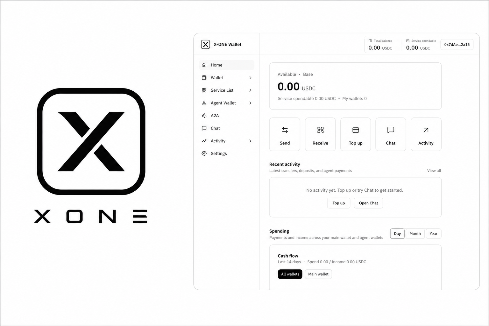
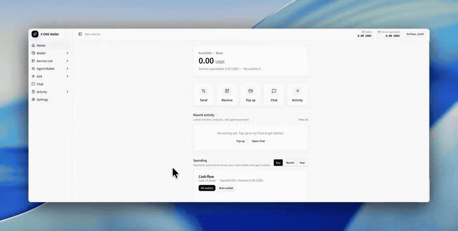
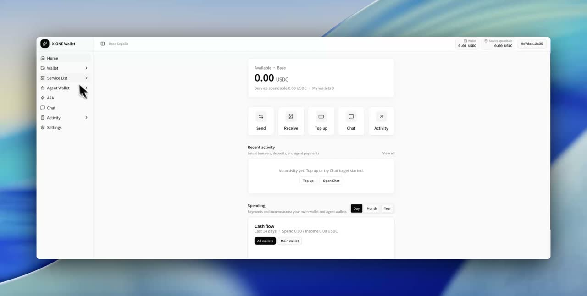

<p align="center">
  
</p>

<h1 align="center">XOne</h1>

<p align="center">
  <strong>Web3 AI wallet</strong> &nbsp;·&nbsp; <strong>Policy-gated agent payments</strong> &nbsp;·&nbsp; <strong>x402</strong>
</p>

<p align="center">
  
  
  
  
  
  
  
  
</p>

<p align="center">
  <a href="https://xonepay.ai/">Website</a>
  <a href="https://docs.xonepay.ai/">docs</a>
</p>

<p align="center">
  
</p>

<!-- GitHub README strips <video>; use GIF for inline playback. Full MP4: docs/readme/hero.mp4 -->
<p align="center">
  
</p>

<p align="center">
  
</p>

---

**XOne** is a Web3 AI wallet and agent payment platform.

It provides two complementary product surfaces in one monorepo:

1. **Consumer wallet** — a web-first wallet for authentication, balances, send/receive, A2A settlement, and a policy-gated AI assistant.
2. **Agent payments** — operator console, spend API keys, SDK, MCP, and HTTP APIs for controlled **x402** payments from agent runtimes.

---

## Overview

| Surface          | Primary apps                                                            | Purpose                                             |
| ---------------- | ----------------------------------------------------------------------- | --------------------------------------------------- |
| Consumer wallet  | `apps/web`, `apps/web-api`                                              | End-user wallet, assistant, developer agent wallets |
| Agent payments   | `apps/console`, `apps/console-api`, `apps/sdk`, `apps/mcp`, `apps/docs` | Keys, limits, ledger, and policy-gated `pay`        |
| Marketing & ops  | `apps/marketing`, `apps/admin`, `apps/admin-api`                        | Public site and internal operations                 |
| Reference seller | `apps/XPayLabs-x402-seller`                                             | Sample x402 merchant for integration tests          |

**Stack:** React · Vite · TypeScript · Tailwind · shadcn/ui · Hono · Cloudflare Pages & Workers · Supabase · Privy · viem · x402

---

## Architecture

```
Consumer
  apps/web  →  apps/web-api (@xone/wallet-api)
                 ├── Supabase (identity & business data)
                 ├── Privy / viem (wallet & chain)
                 ├── LLM assistant (policy-gated tools)
                 └── x402 merchant settle (agent sealed keys)

Operator                          Runtime (agent)
  apps/console  ──JWT──►          @xonepay/sdk | @xone/mcp | HTTP
  apps/console-api                  └── /v1/sdk/* (spend key xone_…)
       ├── keys, limits, pause, soft-delete, ledger
       └── policy enforced server-side on pay
```

**Financial execution path (all surfaces):**

```
Intent → Validation → Policy → Authorization → Execution → Confirmation → Audit
```

Private keys and service-role secrets never ship to the browser. The LLM may propose actions; policy decides whether they auto-execute, require confirmation, or are blocked. Spend tokens cannot perform operator actions (pause, soft-delete, limit updates).

---

## Monorepo layout

```
apps/web                 Consumer wallet UI (Cloudflare Pages)
apps/web-api             Wallet / A2A / assistant API (@xone/wallet-api, Workers)
apps/console             Operator console
apps/console-api         Spend + operator HTTP API (/v1/sdk, /v1/agents, …)
apps/sdk                 @xonepay/sdk — create / get / pay / history
apps/mcp                 @xone/mcp — MCP tools over the spend surface
apps/docs                SDK documentation and playground
apps/marketing           Public marketing site
apps/admin               Operations admin UI
apps/admin-api           Operations admin API
apps/XPayLabs-x402-seller   Sample x402 seller

packages/ui              Shared shadcn primitives (@xone/ui)
packages/types           Shared domain types
packages/schemas         Zod schemas
packages/config          Chains, assets, defaults

docs/readme              README media (logo, banner, hero video)
supabase/                SQL migrations
```

---

## Requirements

- Node.js **≥ 22**
- [pnpm](https://pnpm.io/) **10.x** (see `packageManager` in root `package.json`)

---

## Getting started

```bash
pnpm install
cp .env.example .env
```

Configure per-app environment files as needed (for example `apps/web/.env`, `apps/web-api/.env`).

### Consumer wallet

1. Create a Privy application and set `VITE_PRIVY_APP_ID` in `apps/web/.env`.
2. Allow origin `http://localhost:5173` in the Privy dashboard.
3. Configure `apps/web-api/.env` (Supabase, LLM keys, optional `ALLOW_DEMO_AUTH=true` for local demos, `RELAYER_PRIVATE_KEY` for gas-sponsored USDC fund).

```bash
pnpm dev
```

| Service    | URL                          |
| ---------- | ---------------------------- |
| Web        | http://localhost:5173        |
| API health | http://localhost:4396/health |

### Console and agent API

```bash
pnpm dev:console
```

### Documentation and marketing

```bash
pnpm dev:docs    # SDK docs / playground
pnpm dev:site    # marketing site
```

---

## Product surfaces and authentication

| Surface                                          | Authentication                                                  | Capabilities                                                       |
| ------------------------------------------------ | --------------------------------------------------------------- | ------------------------------------------------------------------ |
| Wallet (`web` + `web-api`)                       | Privy (embedded / external wallets); profile linked via address | Balances, send/receive, A2A, AI assistant, developer agent wallets |
| Console (`console` + `console-api`)              | Operator JWT (Supabase user)                                    | API keys, limits, allowlists, pause/resume, soft-delete, ledger    |
| Spend (`/v1/sdk/*`, `@xonepay/sdk`, `@xone/mcp`) | Agent API key (`xone_…`)                                        | Create/get agent, `pay`, history, spend-policy snapshot            |
| Docs playground                                  | —                                                               | Same HTTP contract for integration testing                         |

**Spend vs operator:** soft-delete, pause, resume, and limit updates require a console JWT. They are not available on the spend token. Calling operator routes with a spend key returns `403` (`operator_required`).

**Spend snapshot:** `getSpendSnapshot()` returns address plus policy headroom (`remainingDaily`, caps, status). It is **not** a live on-chain USDC balance. Fund USDC at the agent address separately.

**Convention:** one API key ↔ one agent ↔ one wallet.

---

## Deployment (Cloudflare)

```bash
pnpm deploy              # wallet-api + web
pnpm deploy:console      # console-api + console
pnpm deploy:docs
pnpm deploy:site
pnpm deploy:ops          # admin-api + admin
```

Worker secrets (`SUPABASE_*`, `RELAYER_PRIVATE_KEY`, LLM keys, etc.) are set with `wrangler secret put`. Frontend `VITE_*` variables are applied at build / CI time.

---

## Security principles

- Do not store raw private keys or seed phrases in the client or in plaintext database columns.
- Agent EOAs used for x402 are sealed server-side; spend keys never expose operator controls.
- All financially relevant mutations should support idempotency where retries are possible.
- External agent / merchant output is untrusted until validated (amount, asset, chain, recipient, expiration).

Project implementation conventions for agents and contributors live in `.cursor/rules/web3-wallet.mdc`.

---

## License

Proprietary — All rights reserved unless otherwise stated by XONEAccount.
